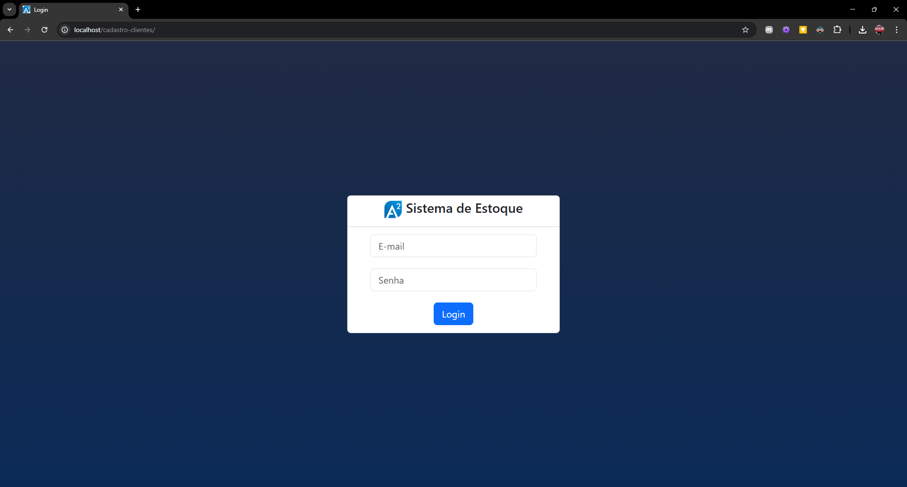
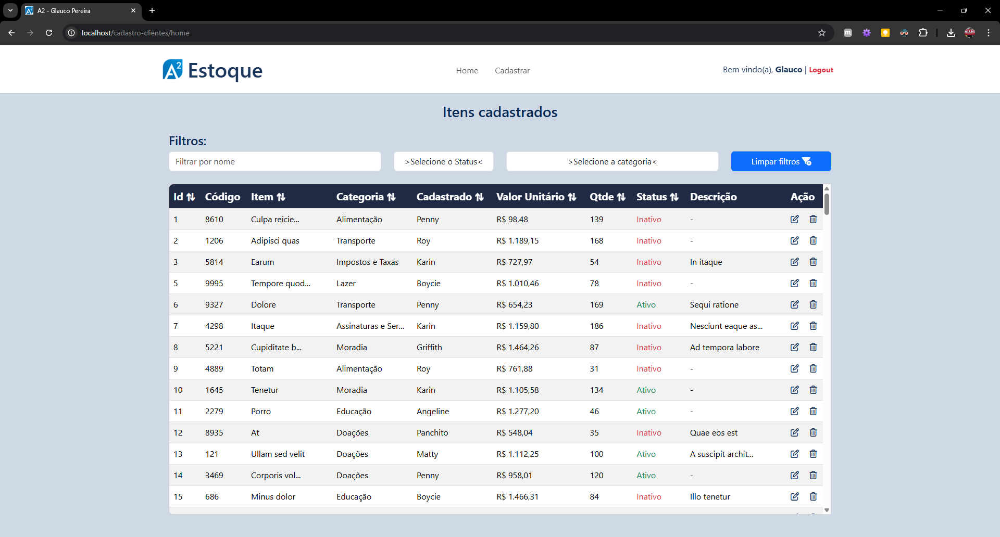
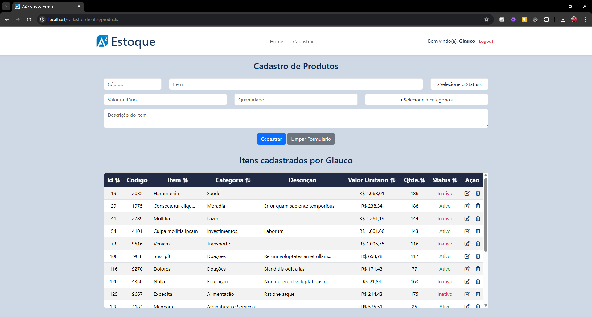

# Documentação Técnica – Sistema de Estoque (PHP 8.0 Puro)

## Visão Geral
Sistema de controle de estoque desenvolvido em PHP 8.0 puro, sem uso de frameworks ou Composer. Permite cadastro, listagem, edição e exclusão de produtos e categorias, além de autenticação de usuários.

Deploy: https://estoque.glaucopereira.com

---

## Uso
O uso é intuitivo, seguem as orientações:

* **Tela de login:** Colocar e-mail e senha (fornecidos nesta documentação) para acesso ao sistema
 


* **Home:** 
  - Listagem geral de produtos cadastrados
  - Possibilidade de filtragem da tabela
  - Possibilidade de edição e exclusão de cada item (campo ação: 📝 edita e 🗑️ exclui)



* **Cadastrar:** 
  - Form para cadastro e edição de produtos com dica em texto dentro do input informando seu campo (validação de dados em tempo real).
  - Listagem de itens cadastrados pelo usuário logado
  - Possibilidade de edição e exclusão de cada item (campo ação: 📝 edita e 🗑️ exclui)


>**Nota:** No canto superior direito (em todo site) é exibido o texto `logout`, clicando nele o sistema desloga o usuário e redireciona para tela de login.
> 
> Todas as rotas são protegidas, somente usuários logados podem acessar, inclusive a página de erro. Qualquer ação deslogada leva a tela de login, garantindo segurança da aplicação.

---

## Como Executar Localmente

1. Clone o repositório (comando no terminal: `git clone https://github.com/gpereira86/A2-Sistema-Estoque.git`) ou copie os arquivos para seu ambiente local.
2. Configure o banco de dados MySQL com as tabelas `users`, `products`, `categories` (arquivo para criação de tabelas e inserção de dados [disponível aqui](documentation/DUMP_BD.sql)).
3. Atualize os arquivos `system/config.php` e `system/secureConfig.php` com os dados do banco.
4. Habilite o módulo `mod_rewrite` no Apache (caso não esteja ativo).
5. Acesse `http://localhost/seu-projeto/` no navegador.

---

## Usuário de Teste

- **E-mail:** `teste@teste.com`
- **Senha:** `123`

>**Nota:** Pode-se usar qualquer usuário cadastrado na tabela users ou memso criar outro. Todas as senhas dos usuários já cadastrados são: `123`

---

## Funcionalidades

- **Autenticação de Usuários**  
    - Login e logout com verificação de sessão via `AuthMiddleware`.


- **Gerenciamento de Produtos**
    - Listagem com categorias e usuário responsável
    - Criação, edição e exclusão com validação de dados
    - Controle de status (ativo/inativo) e quantidade


- **Validações**
    - Backend: regras em `ProductService` e `LoginService`
    - Frontend: classes CSS (`is-invalid`) aplicadas dinamicamente


- **Filtros e Ordenação**
    - Ordenação customizada (`order`, `limit`, `offset`) disponível para uso em atualizações futuras
    - Listagem de produtos cadastrados pelo usuário logado


- **Templates Reutilizáveis**  
    - Layout principal (`master.php`) e partials (`header.php`, `modal.php`, etc.)

---

## Requisitos

- **PHP:** 8.0 ou superior
- **MySQL:** 5.7 ou superior

---

## Dependências

- **PHP Puro** (sem frameworks, sem Composer)
- **Extensões PHP**: PDO, mbstring, filter
- CSS e JavaScript escritos manualmente
- **Bootstrap** 5.3.5 (o projeto usa CDN)
- **Fontawesome** 6.2 (o projeto usa CDN)
- **JQuery** 3.7.1

---

## Banco de Dados

### Estrutura das Tabelas

```sql
CREATE TABLE `categories` (
  `id` INT NOT NULL AUTO_INCREMENT,
  `category` VARCHAR(50) NOT NULL,
  `created_at` TIMESTAMP NOT NULL,
  `uploaded_at` TIMESTAMP NULL,
  PRIMARY KEY (`id`)
);

CREATE TABLE `users` (
  `id` INT NOT NULL AUTO_INCREMENT,
  `name` VARCHAR(100) NOT NULL,
  `email` VARCHAR(100) NOT NULL,
  `level` INT(2) NOT NULL,
  `password` VARCHAR(255) NOT NULL,
  `created_at` TIMESTAMP NOT NULL,
  `updated_at` TIMESTAMP NULL,
  PRIMARY KEY (`id`)
);

CREATE TABLE `products` (
  `id` INT NOT NULL AUTO_INCREMENT,
  `productcode` INT(20) NOT NULL UNIQUE,
  `productname` VARCHAR(50) NOT NULL,
  `description` TEXT NULL,
  `price` DECIMAL(10,2) NOT NULL DEFAULT 0.00,
  `quantity` INT NOT NULL,
  `status` TINYINT(1) NOT NULL,
  `category_id` INT NOT NULL,
  `user_id` INT NOT NULL,
  `created_at` TIMESTAMP NOT NULL,
  `user_id_updated` INT NULL,
  `uploaded_at` TIMESTAMP NULL,
  PRIMARY KEY (`id`)
);
```
>**Nota:** Apesar de não gerado, há um relacionamento entre as tabelas users e prodcts e categories e products. Por escolha, esse relacionamento é tratado apenas dentro da lógica de Back-end, ao cadastrar e alterar informações.
> 
> categories.id (1) ────< (N) products.category_id  
> users.id (1) ───────< (N) products.user_id   
> users.id (1) ───────< (N) products.user_id_updated 


---

## Segurança

- Credenciais sensíveis em `system/secureConfig.php`
- Arquivo `.htaccess` protege pastas críticas
- Middleware `AuthMiddleware` restringe acesso não autenticado

---

## Estrutura de Pastas

- O arquivo secureConfig.php deve ser ignorado pelo .gitignore em seu projeto, pois ele não deve ser compartilhado em caso de uso de credenciais sensíveis.

```
:root/
├── .htaccess
├── index.php
├── .gitignore
├── README.md
├── routes.php
│
├── documentation/
│   ├── DUMP.sql
│   ├── estrutura_de_pastas.txt
│   ├── README.pdf
│   └── Teste_Tecnico_Estagio_Desenvolvimento_Web_A2[1].pdf
│
├── system/
│   ├── Autoloader.php
│   ├── config.php
│   ├── secureConfig.php
│   │
│   ├── controller/
│   │   ├── ErrorController.php
│   │   ├── HomeController.php
│   │   ├── LoginController.php
│   │   └── ProductController.php
│   │
│   ├── core/
│   │   ├── AuthMiddleware.php
│   │   ├── DbConnection.php
│   │   ├── Helpers.php
│   │   ├── Model.php
│   │   └── Render.php
│   │
│   ├── model/
│   │   ├── CategoriesModel.php
│   │   ├── ProductsModel.php
│   │   └── UsersModel.php
│   │
│   └── services/
│       ├── LoginService.php      
│       └── ProductService.php 
│
└── template/
    ├── master.php
    │
    ├── assets/   
    │   ├── css/          
    │   │   ├── header.css
    │   │   ├── main.css
    │   │   └── table.css
    │   │
    │   ├── img/ 
    │   │   ├── error404.css
    │   │   ├── img.png
    │   │   ├── img_logo.png
    │   │   └── img_logo_no_bg.png
    │   │
    │   └── js/ 
    │       ├── filter-fields.js
    │       ├── main.js
    │       ├── modal.js
    │       ├── tableorder.js
    │       └── validator.js
    │
    ├── contents/
    │   ├── error-page.php         
    │   ├── home.php         
    │   ├── login.php         
    │   └── products.php         
    │
    └──partials/   
        ├── header.php         
        └── modal.php 

```

---

## Pontos de Extensão

- **Novas Rotas:** Edite o arquivo `routes.php` para adicionar caminhos e métodos HTTP.


- **Controllers:** Crie novos controllers em `system/controller` seguindo o padrão existente.
 

- **Models:** Adicione modelos em `system/model` que estendam `Core\Model`.


- **Services:** Implemente regras de negócio em `system/Services`.


- **Views:** Coloque novas views em `template/contents` e componentes reutilizáveis em `template/partials` (pode ser necessário incluir em master em caso de partials com o comando: ``` <?php include_once 'partials/newPartials.php'; ?>```).

---

## Observações Finais

Este sistema foi desenvolvido para demonstrar boas práticas em PHP 8.0 puro e arquitetura MVC simples.  
Pode ser facilmente ampliado com:

- Integração de APIs RESTful
- Adoção de um framework PHP (Laravel, Symfony, etc.)
- Camada de testes automatizados (PHPUnit)
- Deploy em containers Docker  


